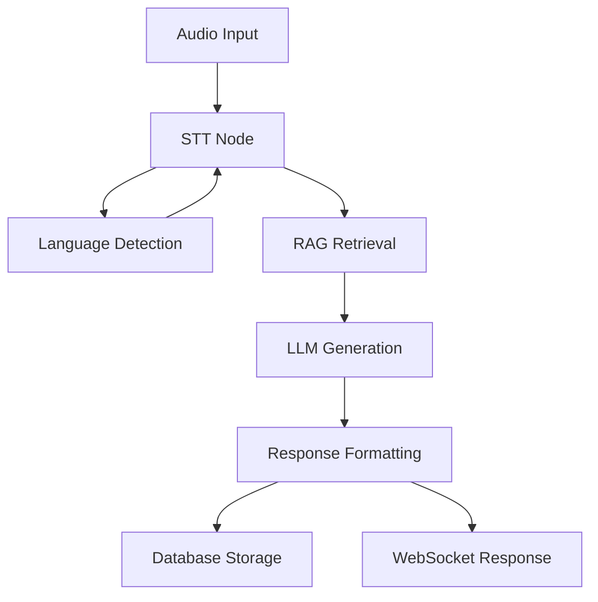

# 🌾 KisanAI - Conversational AI for Agriculture

A full-stack speech-to-text conversational agent designed specifically for agricultural assistance, featuring multilingual support, RAG (Retrieval-Augmented Generation), and real-time voice interaction.

## 🚀 Features

- **Multilingual Speech-to-Text**: Uses `ai4bharat/indic-conformer-600m-multilingual` for accurate transcription in multiple Indian languages
- **Advanced LLM Integration**: Powered by Gemma 3n for intelligent agricultural advice
- **RAG Knowledge Base**: Retrieval-Augmented Generation with agricultural knowledge
- **Real-time Voice Interaction**: WebSocket-based streaming audio processing
- **Session Management**: Persistent chat history with SQLite
- **Modern React Frontend**: Intuitive UI with microphone control and live transcription
- **LangGraph Orchestration**: Modular pipeline for conversation flow

## 🏗️ Architecture

### Backend (Python/FastAPI)
```
backend/
├── app.py                    # FastAPI application
├── transcription_engine.py   # STT with ai4bharat model
├── conversation_manager.py   # LLM integration with Gemma
├── rag_store.py             # FAISS-based knowledge retrieval
├── graph_definition.py      # LangGraph pipeline
├── persistence.py           # SQLite chat persistence
└── requirements.txt         # Python dependencies
```

### Frontend (React)
```
frontend/
├── src/
│   ├── App.jsx              # Main application
│   ├── components/
│   │   ├── MicButton.jsx    # Microphone control
│   │   ├── TranscriptPanel.jsx # Live transcription display
│   │   └── ChatHistory.jsx  # Message history
│   └── api.js              # Backend API client
└── package.json            # Node.js dependencies
```

## 🛠️ Installation & Setup

### Prerequisites
- Python 3.8+
- Node.js 16+
- Git
- FFmpeg (for audio processing) - See [AUDIO_SETUP.md](AUDIO_SETUP.md)

### Quick Start

1. **Clone the repository**
```bash
git clone <repository-url>
cd Kisan_AI
```

2. **Install FFmpeg (Required for audio processing)**
```bash
# Windows (automatic installer)
python install_ffmpeg_windows.py

# Or install manually - see AUDIO_SETUP.md for details
```

3. **Start the Backend**
```bash
python start_backend.py
```
This will:
- Install Python dependencies
- Download required models
- Start the FastAPI server on `http://localhost:8000`

3. **Start the Frontend** (in a new terminal)
```bash
python start_frontend.py
```
This will:
- Install Node.js dependencies
- Start the React development server on `http://localhost:3000`

4. **Access the Application**
- Open `http://localhost:3000` in your browser
- Click the microphone button to start speaking
- The system will transcribe your speech and provide AI responses

### Manual Setup

#### Backend Setup
```bash
cd backend
pip install -r requirements.txt
python app.py
```

#### Frontend Setup
```bash
cd frontend
npm install
npm start
```

## 🎯 Usage

### Starting a Conversation
1. Click the microphone button to start recording
2. Speak your agricultural question in any supported language
3. The system will:
   - Transcribe your speech
   - Detect the language
   - Retrieve relevant knowledge from the RAG store
   - Generate an AI response using Gemma
   - Save the conversation to the database

### Supported Languages
- Hindi (हिंदी)
- English
- Bengali (বাংলা)
- Tamil (தமிழ்)
- Telugu (తెలుగు)
- Gujarati (ગુજરાતી)
- Kannada (ಕನ್ನಡ)
- Malayalam (മലയാളം)
- Marathi (मराठी)
- Punjabi (ਪੰਜਾਬੀ)
- Odia (ଓଡ଼ିଆ)
- Assamese (অসমীয়া)

### API Endpoints

#### REST API
- `GET /` - Health check
- `POST /start_session` - Create new conversation session
- `GET /sessions` - List all sessions
- `GET /sessions/{session_id}/history` - Get session history
- `DELETE /sessions/{session_id}` - Delete session
- `GET /stats` - Get database statistics

#### WebSocket
- `WS /conversation/{session_id}` - Real-time conversation

## 🔧 Configuration

### Environment Variables
Create a `.env` file in the backend directory:

```env
# Server Configuration
SERVER_HOST=0.0.0.0
SERVER_PORT=8000
LOG_LEVEL=INFO

# Model Configuration
ASR_MODEL=ai4bharat/indic-conformer-600m-multilingual
LLM_MODEL=google/gemma-2-2b-it
EMBEDDING_MODEL=sentence-transformers/all-MiniLM-L6-v2

# RAG Configuration
RAG_TOP_K=3
RAG_INDEX_PATH=./rag_index
```

### Model Configuration
- **STT Model**: `ai4bharat/indic-conformer-600m-multilingual`
- **LLM Model**: `google/gemma-2-2b-it` (with fallback to DialoGPT)
- **Embedding Model**: `sentence-transformers/all-MiniLM-L6-v2`

## 📊 Knowledge Base

The system includes a pre-loaded agricultural knowledge base covering:
- Crop diseases and treatments
- Pest management strategies
- Soil management techniques
- Irrigation best practices
- Fertilization guidelines
- Crop rotation advice

## 🔄 Conversation Flow



## 🚀 Deployment

### Production Deployment
1. **Backend**: Use Gunicorn or similar WSGI server
2. **Frontend**: Build and serve static files
3. **Database**: Use PostgreSQL for production
4. **Models**: Consider using model serving infrastructure

### Docker Deployment
```bash
# Build and run with Docker Compose
docker-compose up --build
```

## 🧪 Testing

### Backend Testing
```bash
cd backend
python -m pytest tests/
```

### Frontend Testing
```bash
cd frontend
npm test
```

## 📈 Performance

- **Audio Processing**: 200ms chunks for real-time streaming
- **Transcription**: ~1-2 seconds per 5-second audio clip
- **LLM Response**: ~2-5 seconds depending on model size
- **Database**: SQLite for development, PostgreSQL for production

## 🤝 Contributing

1. Fork the repository
2. Create a feature branch
3. Make your changes
4. Add tests
5. Submit a pull request

## 📄 License

This project is licensed under the MIT License - see the LICENSE file for details.

## 🙏 Acknowledgments

- [ai4bharat](https://ai4bharat.org/) for the multilingual STT model
- [Google](https://ai.google.dev/) for the Gemma language model
- [LangChain](https://langchain.com/) for LLM orchestration
- [FastAPI](https://fastapi.tiangolo.com/) for the backend framework
- [React](https://reactjs.org/) for the frontend framework

## 📞 Support

For support and questions:
- Create an issue on GitHub
- Contact the development team
- Check the documentation

---

**Built with ❤️ for the agricultural community**