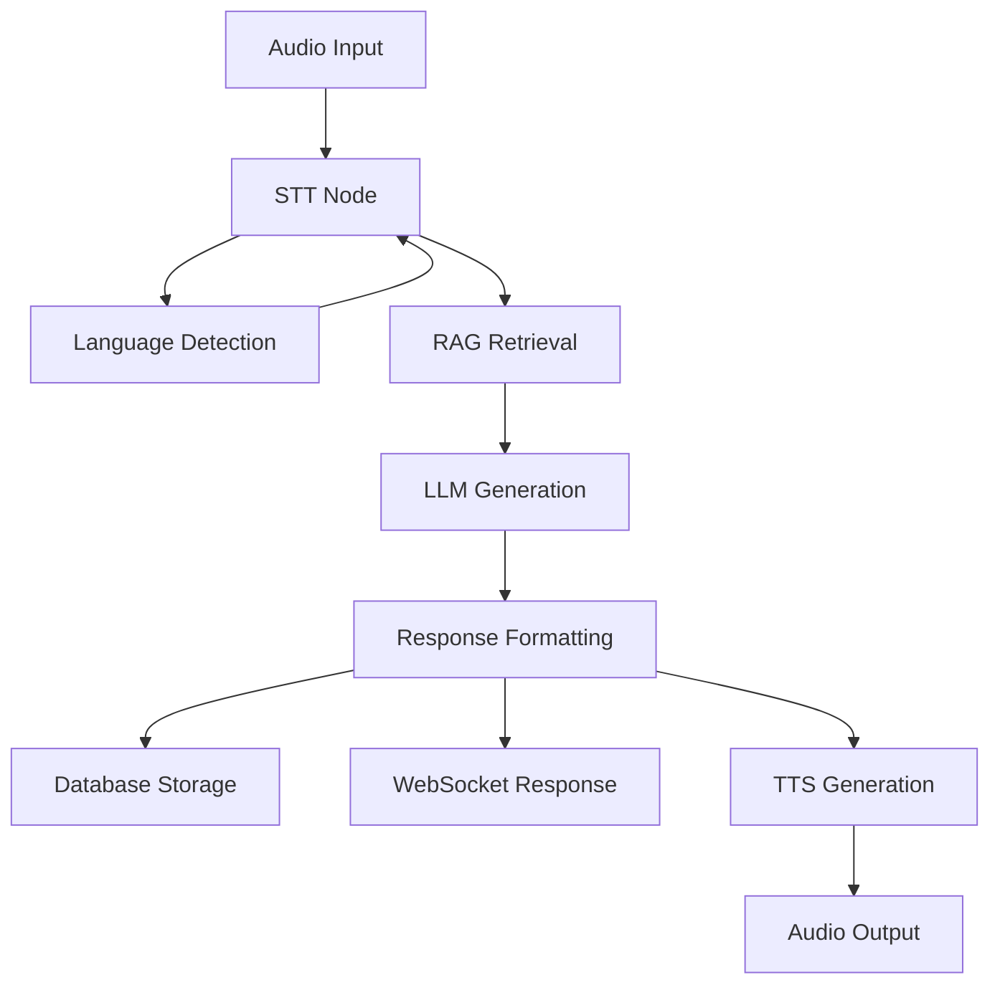

# 🌾 KisanAI - Conversational AI for Agriculture

A full-stack speech-to-text conversational agent designed specifically for agricultural assistance, featuring multilingual support, RAG (Retrieval-Augmented Generation), and real-time voice interaction.

## 🚀 Features

- **Multilingual Speech-to-Text**: Uses `ai4bharat/indic-conformer-600m-multilingual` for accurate transcription in multiple Indian languages
- **Advanced LLM Integration**: Powered by Gemma 2 9B for intelligent agricultural advice
- **RAG Knowledge Base**: Retrieval-Augmented Generation with agricultural knowledge
- **Real-time Voice Interaction**: WebSocket-based streaming audio processing
- **Session Management**: Persistent chat history with SQLite
- **Modern React Frontend**: Intuitive UI with microphone control and live transcription
- **LangGraph Orchestration**: Modular pipeline for conversation flow
- **Virtual Environment Support**: Automatic virtual environment detection and activation

## 🏗️ Architecture

### Backend (Python/FastAPI)
```
backend/
├── app.py                    # FastAPI application
├── transcription_engine.py   # STT with ai4bharat model
├── conversation_manager.py   # LLM integration with Gemma
├── rag_store.py             # FAISS-based knowledge retrieval
├── graph_definition.py      # LangGraph pipeline
├── persistence.py           # SQLite chat persistence
└── tts_engine.py           # Text-to-Speech engine
```

### Frontend (React)
```
frontend/
├── src/
│   ├── App.jsx              # Main application
│   ├── components/
│   │   ├── MicButton.jsx    # Microphone control
│   │   ├── TranscriptPanel.jsx # Live transcription display
│   │   ├── ChatHistory.jsx  # Message history
│   │   ├── ContextPanel.jsx # Context display
│   │   └── StatsPanel.jsx   # Statistics panel
│   └── api.js              # Backend API client
└── package.json            # Node.js dependencies
```

## 📋 Prerequisites

### System Requirements
- **Python**: 3.8+ (3.9+ recommended)
- **Node.js**: 16+ (18+ recommended)
- **Git**: Latest version
- **FFmpeg**: Required for audio processing
- **RAM**: Minimum 8GB (16GB+ recommended for optimal performance)
- **Storage**: At least 10GB free space for models and dependencies

### Platform-Specific Requirements

#### Windows
- Windows 10/11 (64-bit)
- PowerShell 5.1+ or Windows Terminal
- Visual Studio Build Tools (for some Python packages)

#### macOS
- macOS 10.15+ (Catalina or later)
- Xcode Command Line Tools
- Homebrew (recommended for package management)

## 🛠️ Installation & Setup

### Step 1: Clone the Repository

```bash
git clone https://github.com/prasannaarjun/Kisan_AI.git
cd Kisan_AI
```

### Step 2: Install FFmpeg

#### Windows
```powershell
# Option 1: Using Chocolatey (recommended)
choco install ffmpeg

# Option 2: Using winget
winget install ffmpeg

# Option 3: Manual installation
# Download from https://ffmpeg.org/download.html
# Add to PATH: C:\ffmpeg\bin
```

#### macOS
```bash
# Using Homebrew (recommended)
brew install ffmpeg

# Using MacPorts
sudo port install ffmpeg

# Verify installation
ffmpeg -version
```

### Step 3: Set Up Python Environment

#### Windows
```powershell
# Create virtual environment
python -m venv .venv

# Activate virtual environment
.venv\Scripts\activate

# Upgrade pip
python -m pip install --upgrade pip

# Install dependencies
pip install -r requirements.txt
```

#### macOS
```bash
# Create virtual environment
python3 -m venv .venv

# Activate virtual environment
source .venv/bin/activate

# Upgrade pip
python -m pip install --upgrade pip

# Install dependencies
pip install -r requirements.txt
```

### Step 4: Set Up Node.js Environment

#### Both Platforms
```bash
# Navigate to frontend directory
cd frontend

# Install dependencies
npm install

# Return to project root
cd ..
```

## 🚀 Running the Application

### Option 1: Quick Start (Recommended)

Use the integrated launcher that starts both backend and frontend:

```bash
# Activate virtual environment first
# Windows:
.venv\Scripts\activate

# macOS:
source .venv/bin/activate

# Start both services
python run_kisan_ai.py
```

This will:
- ✅ Automatically detect and activate virtual environment
- ✅ Start backend server on `http://localhost:8000`
- ✅ Start frontend server on `http://localhost:3000`
- ✅ Provide real-time status updates
- ✅ Handle graceful shutdown with Ctrl+C

### Option 2: Manual Start

#### Start Backend (Terminal 1)
```bash
# Activate virtual environment
# Windows:
.venv\Scripts\activate
# macOS:
source .venv/bin/activate

# Start backend
python start_backend.py
```

#### Start Frontend (Terminal 2)
```bash
# Activate virtual environment
# Windows:
.venv\Scripts\activate
# macOS:
source .venv/bin/activate

# Start frontend
python start_frontend.py
```

### Option 3: Direct Execution

#### Backend Only
```bash
cd backend
python app.py
```

#### Frontend Only
```bash
cd frontend
npm start
```

## 🌐 Accessing the Application

1. **Open your browser** and navigate to `http://localhost:3000`
2. **Allow microphone permissions** when prompted
3. **Click the microphone button** to start speaking
4. **Speak your agricultural question** in any supported language
5. **View the response** and continue the conversation

## 🎯 Usage Guide

### Starting a Conversation
1. **Click the microphone button** to start recording
2. **Speak clearly** in any supported language
3. **Wait for transcription** to appear
4. **Review the AI response** based on agricultural knowledge
5. **Continue the conversation** as needed

### Supported Languages
- Hindi (हिंदी)
- English
- Bengali (বাংলা)
- Tamil (தமிழ்)
- Telugu (తెలుగు)
- Gujarati (ગુજરાતી)
- Kannada (ಕನ್ನಡ)
- Malayalam (മലയാളം)
- Marathi (मराठी)
- Punjabi (ਪੰਜਾਬੀ)
- Odia (ଓଡ଼ିଆ)
- Assamese (অসমীয়া)

### Features Available
- **Real-time Transcription**: See your speech converted to text
- **Language Detection**: Automatic detection of spoken language
- **Agricultural Knowledge**: AI responses based on agricultural expertise
- **Session Management**: Save and resume conversations
- **Voice Feedback**: Text-to-speech responses (optional)

## 🔧 Configuration

### Environment Variables
Create a `.env` file in the project root:

```env
# Server Configuration
SERVER_HOST=0.0.0.0
SERVER_PORT=8000
LOG_LEVEL=INFO

# Model Configuration
ASR_MODEL=ai4bharat/indic-conformer-600m-multilingual
LLM_MODEL=google/gemma-2-9b-it
EMBEDDING_MODEL=sentence-transformers/all-MiniLM-L6-v2

# RAG Configuration
RAG_TOP_K=3
RAG_INDEX_PATH=./rag_index
```

### Model Configuration
- **STT Model**: `ai4bharat/indic-conformer-600m-multilingual`
- **LLM Model**: `google/gemma-2-9b-it`
- **Embedding Model**: `sentence-transformers/all-MiniLM-L6-v2`

## 📊 Knowledge Base

The system includes a pre-loaded agricultural knowledge base covering:
- Crop diseases and treatments
- Pest management strategies
- Soil management techniques
- Irrigation best practices
- Fertilization guidelines
- Crop rotation advice
- Weather impact on agriculture
- Market information and pricing

## 🔄 Conversation Flow



## 🧪 Testing

### Backend Testing
```bash
# Activate virtual environment
# Windows: .venv\Scripts\activate
# macOS: source .venv/bin/activate

# Run tests
python -m pytest tests/
```

### Frontend Testing
```bash
cd frontend
npm test
```

## 🚀 Deployment

### Production Deployment

#### Backend
```bash
# Install production dependencies
pip install gunicorn

# Run with Gunicorn
gunicorn backend.app:app -w 4 -k uvicorn.workers.UvicornWorker
```

#### Frontend
```bash
cd frontend
npm run build
# Serve the build directory with a web server
```

### Docker Deployment
```bash
# Build and run with Docker Compose
docker-compose up --build
```

## 🐛 Troubleshooting

### Common Issues

#### 1. Virtual Environment Not Found
```bash
# Create virtual environment
python -m venv .venv

# Activate it
# Windows: .venv\Scripts\activate
# macOS: source .venv/bin/activate
```

#### 2. FFmpeg Not Found
```bash
# Windows
choco install ffmpeg
# or download from https://ffmpeg.org/

# macOS
brew install ffmpeg
```

#### 3. Port Already in Use
```bash
# Kill process using port 8000
# Windows
netstat -ano | findstr :8000
taskkill /PID <PID> /F

# macOS
lsof -ti:8000 | xargs kill -9
```

#### 4. Module Import Errors
```bash
# Ensure you're in the project root
cd Kisan_AI

# Activate virtual environment
# Windows: .venv\Scripts\activate
# macOS: source .venv/bin/activate

# Reinstall dependencies
pip install -r requirements.txt
```

#### 5. Node.js Dependencies Issues
```bash
cd frontend
rm -rf node_modules package-lock.json
npm install
```

### Performance Optimization

#### For Better Performance
1. **Increase RAM**: Use 16GB+ for optimal model loading
2. **SSD Storage**: Use SSD for faster model loading
3. **GPU Support**: Install CUDA for GPU acceleration (optional)
4. **Close Other Applications**: Free up system resources

#### For Lower Resource Usage
1. **Use Smaller Models**: Modify model configuration
2. **Reduce Batch Size**: Adjust processing parameters
3. **Disable TTS**: Turn off text-to-speech if not needed

## 📈 Performance Metrics

- **Audio Processing**: 200ms chunks for real-time streaming
- **Transcription**: ~1-2 seconds per 5-second audio clip
- **LLM Response**: ~2-5 seconds depending on model size
- **Database**: SQLite for development, PostgreSQL for production
- **Memory Usage**: ~4-8GB RAM for full functionality

## 🤝 Contributing

1. Fork the repository
2. Create a feature branch: `git checkout -b feature-name`
3. Make your changes
4. Add tests for new functionality
5. Commit your changes: `git commit -m "Add feature"`
6. Push to the branch: `git push origin feature-name`
7. Submit a pull request

### Development Setup
```bash
# Install development dependencies
pip install -r requirements-dev.txt

# Run pre-commit hooks
pre-commit install

# Run tests
python -m pytest tests/ -v
```

## 📄 License

This project is licensed under the MIT License - see the [LICENSE](LICENSE) file for details.

## 🙏 Acknowledgments

- [ai4bharat](https://ai4bharat.org/) for the multilingual STT model
- [Google](https://ai.google.dev/) for the Gemma language model
- [LangChain](https://langchain.com/) for LLM orchestration
- [FastAPI](https://fastapi.tiangolo.com/) for the backend framework
- [React](https://reactjs.org/) for the frontend framework
- [Hugging Face](https://huggingface.co/) for model hosting

## 📞 Support

For support and questions:
- 📧 Create an issue on [GitHub](https://github.com/prasannaarjun/Kisan_AI/issues)
- 📖 Check the [documentation](https://github.com/prasannaarjun/Kisan_AI/wiki)
- 💬 Join our community discussions
- 📧 Contact the development team

## 🔗 Useful Links

- [API Documentation](http://localhost:8000/docs) (when running)
- [Frontend Application](http://localhost:3000) (when running)
- [Model Documentation](https://huggingface.co/ai4bharat/indic-conformer-600m-multilingual)
- [FastAPI Documentation](https://fastapi.tiangolo.com/)
- [React Documentation](https://reactjs.org/docs/)

---

**Built with ❤️ for the agricultural community**

*Empowering farmers with AI-driven agricultural assistance in their native languages.*